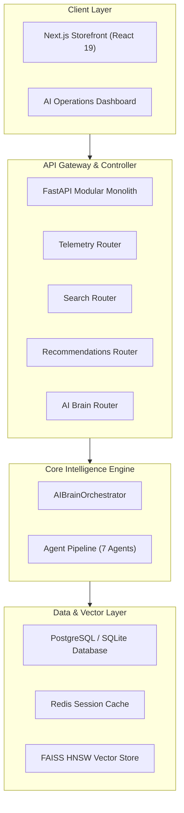
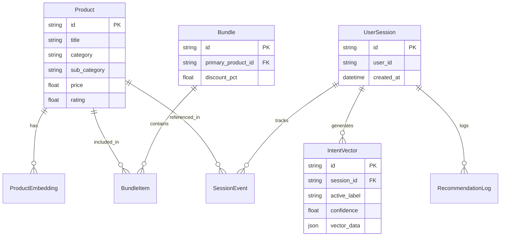
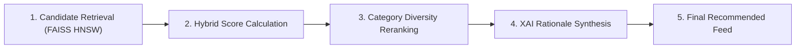

# IntentIQ Architecture Blueprint

This document describes the architectural design, system topology, component interactions, and data processing pipelines of IntentIQ.

---

## 1. Overall System Architecture

IntentIQ is designed as an async modular monolith backend paired with a Next.js App Router frontend storefront. The system decouples interactive client events from heavy vector computation through an internal AI Brain Orchestrator.



---

## 2. Backend Architecture

The backend is built with **FastAPI** and uses a clean Repository pattern for database access and discrete Agent modules for intelligence tasks.

### Core Modules
- **`app/api/v1/`**: REST endpoint controllers managing HTTP serialization and parameter validation.
- **`app/agents/`**: Domain-specific AI agents responsible for discrete tasks (intent analysis, vector search, candidate reranking, bundle selection, explainability, analytics, guardrails).
- **`app/core/`**: Infrastructure singletons for database sessions, Redis caching, FAISS vector indices, and LLM clients.
- **`app/repositories/`**: Data access layer managing SQLAlchemy model interactions.

---

## 3. Frontend Architecture

The frontend is implemented using **Next.js 15 App Router**, **TypeScript**, **Tailwind CSS**, and **Zustand**.

### Component Organization
- **`src/app/`**: Route pages including Home (`/`), Search (`/search`), Product Details (`/product/[id]`), and Operations Dashboard (`/dashboard`).
- **`src/components/`**: Modular UI components organized by domain (`brain/`, `feed/`, `search/`, `cart/`, `privacy/`, `layout/`).
- **`src/store/`**: Zustand central state store managing session identifiers, cart contents, active intent states, and drawer modals.
- **`src/hooks/`**: Custom hooks for capturing client-side clickstream events and dwell time telemetry.

---

## 4. Database Architecture

The data layer uses SQLAlchemy ORM supporting both PostgreSQL (for production deployments) and SQLite (for zero-config local development).



---

## 5. Recommendation Pipeline

Recommendations are generated through a multi-stage hybrid pipeline combining vector similarity, item popularity, cold-start handling, and diversity reranking.



---

## 6. Vector Search Pipeline

IntentIQ transforms product metadata into 384-dimensional dense vector embeddings using `sentence-transformers/all-MiniLM-L6-v2`.

1. **Text Construction:** Combines product title, category, sub-category (aisle), and description.
2. **Embedding Generation:** Computes dense vector representations.
3. **FAISS Indexing:** Indexes vectors into a fast Flat Inner Product / HNSW vector index (`faiss_index.bin`).
4. **Query Execution:** Executes vector dot product similarity search during semantic queries.

---

## 7. AI Agent Orchestration

The `AIBrainOrchestrator` sequences execution across 7 specialized agents to form a single, unified response.

```
Request Received
       │
       ▼
1. GuardrailAgent (Input validation & prompt safety)
       │
       ▼
2. IntentAgent (Telemetry aggregation & vector calculation)
       │
       ▼
3. SearchAgent (FAISS similarity & keyword fallback)
       │
       ▼
4. RecommendationAgent (Candidate filtering & scoring)
       │
       ▼
5. BundleAgent (Co-occurrence basket completion)
       │
       ▼
6. ExplainabilityAgent (Gemini LLM / Template synthesizer)
       │
       ▼
7. AnalyticsAgent (Execution profiling & log audit)
       │
       ▼
Unified Response Payload Returned
```

---

## 8. Caching Strategy

IntentIQ employs a multi-tiered caching approach:
- **Redis Cache:** Caches calculated user intent vectors, hot product recommendations, and search results with configurable TTL.
- **In-Memory Fallback:** An in-memory cache handler (`InMemoryRedisFallback`) ensures zero-downtime operation if a Redis server is unreachable.
- **FAISS Singleton:** The vector index is loaded into memory on application startup to ensure sub-millisecond query performance.

---

## 9. Security & Privacy

- **DPDP Act Compliance:** Provides endpoints and client controls to purge user session telemetry and active intent vectors upon request.
- **Secret Isolation:** Environment variables isolate database credentials, API keys, and application secrets.
- **Input Sanitization:** Guardrail agents sanitize natural language search inputs against injection patterns.

---

## 10. Scalability & Deployment

- **Stateless Application Servers:** FastAPI instances are fully stateless and scale horizontally behind a load balancer.
- **Managed Database Layer:** Designed to connect to managed PostgreSQL databases (such as Neon PostgreSQL) with connection pooling.
- **Container Orchestration:** Ready for containerized deployment via Docker Compose or Kubernetes manifests.
