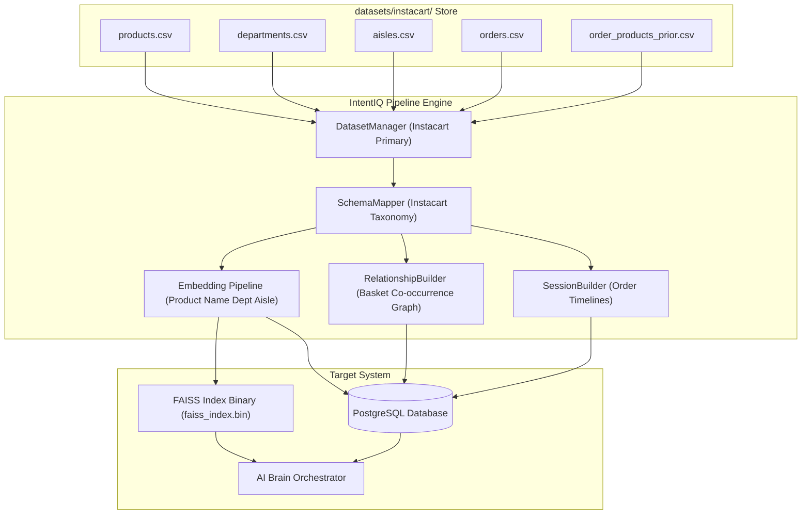

# IntentIQ — Enterprise Data Intelligence Pipeline (Instacart Primary)

**Architectural Role:** Production Data Pipeline & Instacart Dataset Refactoring  
**Authors:** Principal ML Platform Engineer (Amazon Personalize), Senior Data Architect  
**Current MVP Provider:** Instacart Online Grocery Basket Analysis  

---

## Executive Overview

The IntentIQ architecture is provider-agnostic and extensible. For the MVP, **Instacart is the primary active dataset provider** because it provides complete customer sessions, basket purchase sequences, product taxonomy (departments and aisles), and item co-occurrence behaviors, making it ideal for real-time multi-intent modeling.

H&M and Amazon extractors remain supported as optional future providers.

---

## Instacart Dataset Files (`datasets/instacart/`)

The pipeline streams and processes the following Kaggle files:

- `products.csv` $\rightarrow$ Product titles & IDs
- `departments.csv` $\rightarrow$ Product category taxonomy
- `aisles.csv` $\rightarrow$ Sub-category / aisle placement
- `orders.csv` $\rightarrow$ Authentic customer purchase timelines
- `order_products__prior.csv` (or `order_products_prior.csv`) $\rightarrow$ Basket item co-occurrences & bundle graph
- `order_products__train.csv` (or `order_products_train.csv`) $\rightarrow$ Supplemental evaluation baskets

---

## Pipeline Architecture & 12 Core Checkpoints



---

## CLI Usage

```bash
cd backend

# Check Instacart dataset detection status & row counts
python ingest.py --stats

# Ingest Instacart dataset (Default sample size: 1000 items)
python ingest.py --dataset instacart --sample-size 1000

# Run full 12-point verification suite
python verify_pipeline.py
```

---

## Health Verification Endpoint (`GET /api/v1/system/health`)

```json
{
  "status": "HEALTHY",
  "dataset": {
    "provider": "Instacart",
    "loaded": true,
    "products": 49688,
    "departments": 21,
    "aisles": 134,
    "orders": 3421083,
    "prior_order_items": 32434489,
    "train_order_items": 1384617
  },
  "embeddings": {
    "generated": 1000,
    "model_version": "sentence-transformers/all-MiniLM-L6-v2",
    "dimension": 384,
    "coverage_pct": 100.0
  },
  "faiss": {
    "indexed_vectors": 1000,
    "disk_binary_exists": true
  },
  "recommendation_engine": {
    "using_real_dataset": true,
    "active_provider": "Instacart",
    "hybrid_recs_active": true,
    "bundle_graph_active": true
  }
}
```
