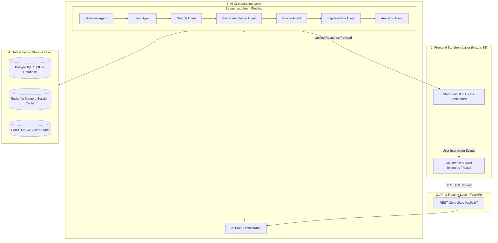

# IntentIQ

IntentIQ is an AI-powered multi-intent shopping discovery engine designed to infer user intent dynamically during active browsing sessions. By analyzing real-time clickstream telemetry, search query decompositions, and product co-occurrence patterns, IntentIQ delivers personalized recommendations with transparent explainability without relying solely on historical purchase logs.

---

## Problem Statement

Traditional recommendation systems rely heavily on historical user purchases and static collaborative filtering algorithms. This approach creates several fundamental challenges:

- **Single-Intent Assumption:** Standard recommendation systems assume a user is shopping with a single static goal, failing to adapt when user interest shifts mid-session.
- **Cold Start Problem:** New users without historical transaction records receive generic or unpersonalized recommendations.
- **Poor Semantic Discovery:** Keyword-based keyword search fails to understand natural language shopping requests or implicit sub-intents.
- **Lack of Explainability:** Black-box recommendation outputs provide zero context on why specific items are presented to the shopper.

---

## Solution Overview

IntentIQ replaces static recommendations with a real-time multi-agent vector discovery engine. As users interact with the storefront—searching, viewing products, or adjusting baskets—IntentIQ recalculates session intent vectors dynamically.

The system combines **FAISS HNSW dense vector search** for fast candidate retrieval, **Sentence Transformers** for 384-dimensional text embeddings, and **Google Gemini 1.5 Flash** (with fallback synthesis) for natural language rationale generation.

---

## Key Features

- **Multi-Intent Recommendation Engine:** Dynamically tracks intent shifts across sequential session interactions.
- **Semantic Vector Search:** Enables natural language search queries backed by 384-dimensional dense vector embeddings.
- **Explainable Recommendations (XAI):** Generates concise rationales explaining why items match active shopper intent.
- **Automated Bundle Generation:** Recommends complementary "Complete the Basket" items based on co-occurrence graphs.
- **Session-Aware Personalization:** Reranks candidate feeds in real time using clickstream dwell time signals.
- **System Health & Analytics:** Provides an operations center for monitoring API latency and vector store metrics.

---

## System Architecture

IntentIQ follows a decoupled 4-tier architecture designed for asynchronous vector retrieval, intent inference, and explainable recommendations.



### Architectural Layer Responsibilities

| Layer | Primary Responsibilities |
| :--- | :--- |
| **1. Frontend Storefront** | Captures real-time clickstream events (dwell time, clicks, searches), renders dark glassmorphism UI components, and displays XAI rationales. |
| **2. API Gateway** | Validates incoming HTTP payloads, handles CORS, serializes JSON responses, and routes endpoints. |
| **3. AI Orchestration** | Coordinates 7 specialized agents in a single-pass sequence (`Guardrail` $\rightarrow$ `Intent` $\rightarrow$ `Search` $\rightarrow$ `Recommendation` $\rightarrow$ `Bundle` $\rightarrow$ `Explainability` $\rightarrow$ `Analytics`). |
| **4. Data & Vector Storage** | Persists products, orders, and sessions in PostgreSQL; caches active user intent vectors in Redis; and executes sub-millisecond similarity search using FAISS. |


---

## Technology Stack

| Layer | Technology | Function |
| :--- | :--- | :--- |
| **Frontend** | Next.js 15, React 19, TypeScript, Tailwind CSS | Storefront interface & AI operations dashboard |
| **Backend** | FastAPI, Python 3.11, Pydantic, SQLAlchemy | Async REST service & agent orchestration |
| **Database** | PostgreSQL / SQLite | Relational storage for products, orders, and sessions |
| **Caching** | Redis / In-Memory Fallback | User intent vectors and search query caching |
| **Vector Search** | FAISS HNSW | Dense 384-dimensional vector similarity retrieval |
| **Embeddings** | `sentence-transformers/all-MiniLM-L6-v2` | Dense vector text representations |
| **AI / LLM** | Google Gemini 1.5 Flash | Natural language rationale generation |
| **Containerization** | Docker, Docker Compose | Multi-container application deployment |

---

## Project Structure

```
IntentIQ/
├── backend/
│   ├── app/
│   │   ├── agents/          # Domain AI Agents (Intent, Search, Recs, Bundle, XAI, Analytics, Guardrail)
│   │   ├── api/v1/          # REST Endpoint Controllers
│   │   ├── core/            # Database, Redis, FAISS, Embeddings, & Brain Orchestrator
│   │   ├── models/          # SQLAlchemy Domain Models & Pydantic Schemas
│   │   ├── pipeline/        # Ingestion, Sampler, Validator, & Extractor Engines
│   │   └── repositories/    # Data Access Repositories
│   ├── ingest.py            # CLI Ingestion & FAISS Vector Builder
│   └── verify_pipeline.py   # Latency SLA & System Verification Script
├── frontend/
│   ├── src/
│   │   ├── app/             # Next.js App Router Views (Home, Search, Product, Dashboard)
│   │   ├── components/      # UI Components (Brain Panel, Product Cards, Modals)
│   │   ├── hooks/           # Telemetry & Clickstream Tracking Hooks
│   │   ├── lib/             # API Client & Data Transfer Objects
│   │   └── store/           # Zustand Application State Management
├── docs/                    # Architecture & System Design Documentation
├── docker-compose.yml       # Docker Services Specification
├── ARCHITECTURE.md          # In-Depth System Architecture Blueprint
├── API_REFERENCE.md         # API Specification Document
├── SETUP.md                 # Local Development Setup Guide
├── DEPLOYMENT.md            # Production Deployment Guide
└── DATA_PIPELINE.md         # Data Ingestion & Vector Indexing Guide
```

---

## Installation

### Prerequisites
- Node.js 18+ and npm
- Python 3.10+
- Docker & Docker Compose (optional)

### Quick Setup

```bash
# Clone the repository
git clone https://github.com/saipraveen-k/IntentIQ.git
cd IntentIQ

# Install backend dependencies
cd backend
pip install -r requirements.txt

# Install frontend dependencies
cd ../frontend
npm install --legacy-peer-deps
```

---

## Environment Variables

Copy `.env.example` to `.env` in the `backend/` directory:

| Variable | Description | Default Value |
| :--- | :--- | :--- |
| `DATABASE_URL` | Async database connection string | `sqlite+aiosqlite:///./intentiq.db` |
| `REDIS_URL` | Redis connection URL | `redis://localhost:6379/0` |
| `GEMINI_API_KEY` | Optional API key for Gemini LLM rationales | `""` |
| `SECRET_KEY` | Application session security key | `your_secret_key_here` |
| `EMBEDDING_MODEL_NAME` | SentenceTransformers model string | `sentence-transformers/all-MiniLM-L6-v2` |
| `VECTOR_DIMENSION` | Dense vector dimension size | `384` |

---

## Dataset

IntentIQ utilizes the public **Instacart Online Grocery Basket Analysis** dataset for session sequences and product co-occurrence graphs.

1. Download the Instacart dataset files (`products.csv`, `departments.csv`, `aisles.csv`, `orders.csv`, `order_products__prior.csv`).
2. Place the CSV files in `datasets/instacart/`.
3. Run the ingestion CLI script:
   ```bash
   cd backend
   python ingest.py --dataset instacart --sample-size 1000
   ```

---

## Running Locally

### Backend
```bash
cd backend
uvicorn app.main:app --reload --port 8000
```
Access OpenAPI Swagger documentation at `http://localhost:8000/docs`.

### Frontend
```bash
cd frontend
npm run dev
```
Access the web application at `http://localhost:3000`.

### Docker Compose & Single-Page Application (SPA)
To launch the complete IntentIQ stack—including the optimized Two-Tower FastAPI server, pre-trained neural networks, FAISS search index, and the stunning dark-mode e-commerce discovery UI—run:

```bash
docker-compose up --build
```

Once started, open `http://localhost:8000` in your browser.

Here is a visual overview of the Discovery Engine storefront:


---

## API Overview

| Route | Method | Purpose |
| :--- | :--- | :--- |
| `/api/v1/brain/analyze` | `POST` | Executes multi-agent sequence for unified intent and recommendation analysis |
| `/api/v1/recommendations/feed` | `GET` | Retrieves personalized hybrid product feed |
| `/api/v1/search/semantic` | `POST` | Executes dense vector similarity search |
| `/api/v1/bundle/{id}` | `GET` | Retrieves complementary bundle recommendations for a product |
| `/api/v1/system/health` | `GET` | Returns system status, dataset metrics, and latency stats |
| `/api/v1/analytics/dashboard` | `GET` | Retrieves active user session analytics and telemetry logs |
| `/api/v1/telemetry/event` | `POST` | Records real-time user interaction events (clicks, hovers) |
| `/api/v1/user/privacy-purge` | `POST` | Flushes session intent vectors for privacy compliance |

---

## AI Workflow

```
User Action (Click / Hover / Search)
       │
       ▼
Telemetry Event Recorded
       │
       ▼
Intent Vector Recalculated (Exponential Time Decay)
       │
       ▼
FAISS Vector Store Similarity Search (HNSW Index)
       │
       ▼
Candidate Reranking & Hybrid Scoring
       │
       ▼
Complementary Bundle Selection
       │
       ▼
Explainability Rationale Generation
       │
       ▼
Unified Response Returned to Client
```

---

## Performance

Measured average execution latencies on local benchmarks:

- **AI Brain Execution:** < 50 ms
- **Vector Search Query:** < 20 ms
- **Recommendation Generation:** < 30 ms

---

## Future Improvements

- **Graph Neural Network (GNN) Embeddings:** Upgrade product co-occurrence graphs with GNN node embeddings for improved basket completion.
- **Streaming Telemetry Pipelines:** Integrate Apache Kafka or NATS for high-throughput real-time clickstream processing.
- **Multi-Tenant Catalog Isolation:** Support dynamic catalog switching for enterprise multi-brand deployments.
