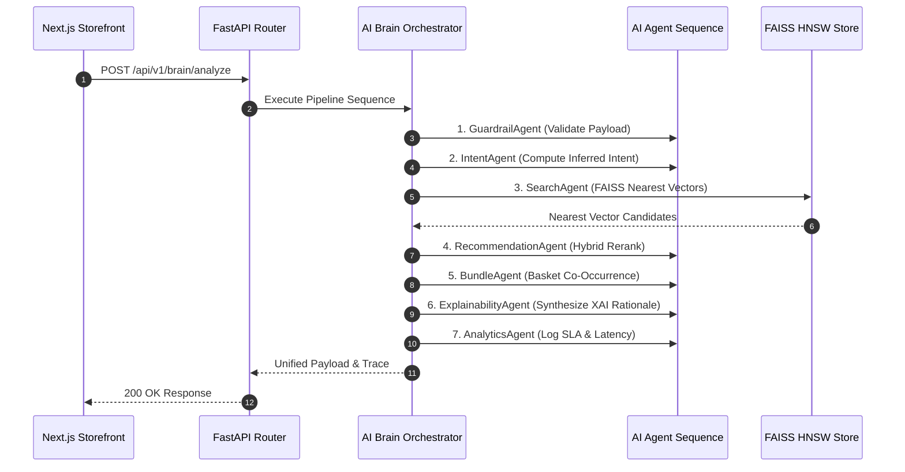

# IntentIQ AI Workflow & Agent Pipeline Sequence

IntentIQ uses an orchestrated multi-agent pipeline to calculate intent vectors and synthesize explainable recommendations.

## Agent Responsibilities

- **Guardrail Agent:** Validates request parameters and screens input strings against injection patterns.
- **Intent Agent:** Computes active session intent vectors using clickstream dwell time signals.
- **Search Agent:** Queries the FAISS index to retrieve candidate items matching dense vector representations.
- **Recommendation Agent:** Reranks candidate items using a hybrid scoring algorithm combining vector similarity, item ratings, and category diversity metrics.
- **Bundle Agent:** Selects complementary product pairs based on item co-occurrence matrices.
- **Explainability Agent:** Synthesizes clear natural language rationales explaining why items are recommended.
- **Analytics Agent:** Records execution metrics, per-agent latency breakdowns, and audit logs.
