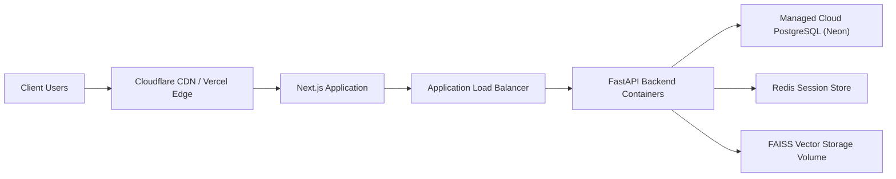

# IntentIQ Deployment Architecture

This document describes the production deployment topology and infrastructure configuration for IntentIQ.

## Infrastructure Configuration

- **Frontend Hosting:** Vercel or Node.js container host serving static and server-rendered Next.js pages.
- **Backend Hosting:** Containerized FastAPI app running under Gunicorn/Uvicorn on managed container services (AWS ECS, GCP Cloud Run, Railway, Render).
- **Relational Database:** Managed PostgreSQL instance (Neon, AWS RDS) accessed via SQLAlchemy `asyncpg`.
- **Session & Intent Cache:** Managed Redis cluster or fallback in-memory store.
- **Vector Storage:** FAISS binary vector index (`faiss_index.bin`) persisted to container storage or loaded into RAM on startup.
