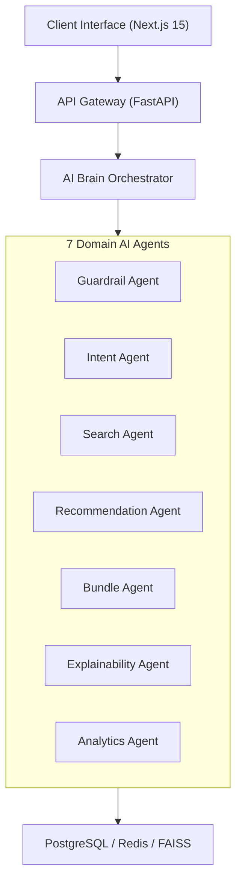

# IntentIQ System Design & Topology

This document details the system design, core modules, and domain interactions of IntentIQ.

## System Topology

## Data Flow Principles
1. **Event Capture:** User telemetry events (clicks, hovers, search queries) are dispatched to `/api/v1/telemetry/event`.
2. **Intent Calculation:** Intent scores are decayed over time using exponential decay functions to favor recent interactions.
3. **Candidate Recall:** FAISS vector similarity search retrieves Top-K nearest vector candidates.
4. **Scoring & Reranking:** Candidate items are reranked using a hybrid score combining vector distance, popularity ratings, and category diversity weights.
5. **Payload Synthesis:** Rationales are attached to recommended items and returned to the client in a single unified JSON payload.
